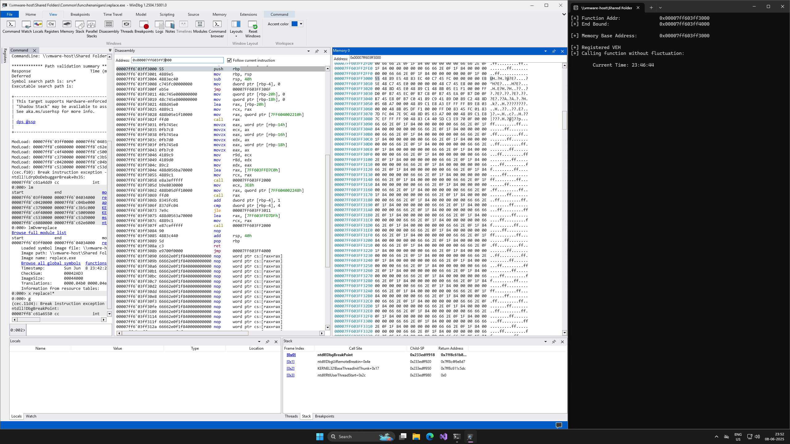
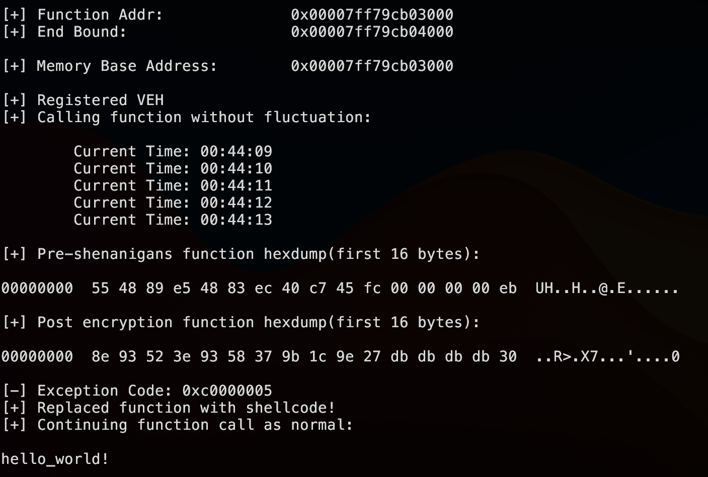

# funcshenanigans

This research was inspired by the [Shellcode Fluctuation](https://github.com/mgeeky/ShellcodeFluctuation) technique along with [this blog about a self mutating program](https://ephemeral.cx/2013/12/writing-a-self-mutating-x86_64-c-program/). So far we have seen the fluctuation technique be used for things like Shellcode and entire PEs, but I wanted to try and use this technique for something simpler - fluctuating just one function. 

The goal was to experiment with function bounds, memory protection and VEHs. This repositgory documents the results of such experiments in a very rough way, documenting the techniques as we go. 

## Pre-requisites 

- Mingw Compiler 
- Make 

Note that all the C code discussed here is very Mingw specific, but I am sure there is a way to make this work with MSVC compiler as well. 

## Bounding functions 

Looking at `bound.c` you will see that it contains the following functions:

```c
__attribute__((aligned(FUNC_SIZE)))
VOID fluctuate() {
	for (int i = 0; i < 5; i++) {
		SYSTEMTIME st = { 0 };
		GetLocalTime(&st);
		printf("\tCurrent Time: %02d:%02d:%02d\n", st.wHour, st.wMinute, st.wSecond);
		Sleep(1000);
	}
  printf("\n");
}

// Boundary function to mark the end bound of the function to fluctuate
__attribute__((aligned(FUNC_SIZE)))
void __boundary_func() {}
```

There are two functions here: `fluctuate()` and `__boundary_func()`:
	
- `fluctuate()` contains the actual code which we want to _fluctuate_ (or experiment with)
- `__boundary_func()` is an empty function which marks the "end" of the `fluctuate()` function. We use this function address to mark the beginning of the next _page_ in memory (more on this later).

Now the next thing, both functions have the `__attribute__((aligned(FUNC_SIZE)))` where `FUNC_SIZE` is set to 4096 which is the size of one page of memory on Windows (page size on Windows is 4KB = 4*1024 bytes). Having the consecutive functions aligned to 4096 bytes ensures that the `fluctuate()` function occupies the whole page as the next `__boundary_func()` needs to be aligned to 4096 bytes as well, ensuring that it starts at the very next page of memory.

This arrangement is required for this technique to work -  that our functions are confided to a single page (it can be more than one page - but this is a simple PoC so we are not going to dip into that can of worms). 

Therefore, after compilation, the code should look something like:

```
+++++++++++++++++++++++ Page start
|                     |  
|     fluctuate()     | < One page of memory >
|                     |   
+++++++++++++++++++++++ End of function 
|                     |
|     Garbage Data    |
|                     |
+++++++++++++++++++++++ Next page start
|                     |
|  __boundary_func()  |
|                     |
+++++++++++++++++++++++ 
```

We need the `fluctuate()` function to occupy one page of memory because when we change the memory permissions of a region of memory, we change the memory permissions of the page as a whole. Having other data or functions in that memory region might cause unexpected behaviour.

We can also make sure that the `fluctuate()` function starts at the beginning of a new page by using `VirtualQuery()` (see `get_mem_base_address()` function in `common.c`).

We can also verify this setup in windbg as:



We see that after the code for the `fluctuate()` function ends, the page is filled with a nop sled till the beginning of the next page who's start is marked by the address of the `__boundary_func()`, showing that our code works as intended. 

## Experiment 1: Replacing functionality 

> See: `replace.c`

My first thought with this, inspired from [this blog about a self mutating program](https://ephemeral.cx/2013/12/writing-a-self-mutating-x86_64-c-program/) was: "What if I replace the functionality of the code?" 

My idead was to have a benign function, but then use some VEH magic to replace it's functionality at runtime to run malicious code. And that's what I did! 

Let's look at the main function: 

```c
int main() {	
	printf("[+] Function Addr: \t\t0x%p\n", fluctuate);
	printf("[+] End Bound:     \t\t0x%p\n\n", __boundary_func);

    get_mem_base_address((LPVOID)fluctuate);

	// Register VEH 
	PVOID p_veh_h = AddVectoredExceptionHandler(1, (PVECTORED_EXCEPTION_HANDLER)replacer_veh);
	if (p_veh_h == NULL) {
		printf("[-] AddVectoredExceptionHandler() failed\n");
		return -1;
	}
	printf("\n[+] Registered VEH\n");

	printf("[+] Calling function without fluctuation:\n\n");
	fluctuate();

    // Convert Page into RW 
    DWORD oldp = 0;

    do {
        printf("[+] Pre-shenanigans function hexdump(first 16 bytes):\n\n");
        hexdump(fluctuate, FUNC_SIZE/256);
        printf("\n");

        // Change Page to RW
        if (!VirtualProtect((LPVOID)fluctuate, FUNC_SIZE, PAGE_READWRITE, &oldp)) {
            eprint("VirtualProtect");
            break;
        }

        // XOR it
        byte_xor((unsigned char *)fluctuate, FUNC_SIZE, XOR_BYTE);

        printf("[+] Post encryption function hexdump(first 16 bytes):\n\n");
        hexdump(fluctuate, FUNC_SIZE/256);
        printf("\n");

        // Change permission to NO_ACCESS
        if (!VirtualProtect((LPVOID)fluctuate, FUNC_SIZE, PAGE_NOACCESS, &oldp)) {
            eprint("VirtualProtect");
            break;
        }
        
        fluctuate();
        printf("---------------------------------------------------------------------------\n");

    } while(FALSE);
	
	
	if (p_veh_h) RemoveVectoredExceptionHandler(p_veh_h); 
	return 0;
}
```

The first interesting thing to note here is that we register a VEH called `replacer_veh`. We will get to that later. Next up, inside the `do-while` loop, we first print the first 16 bytes of the `fluctuate` function just so that we can compare our results later. 

Next, we use `VirtualProtect()` to change the page permissions of `fluctuate` to RW and use a single byte XOR encryption to encrypt the memory of the function (pardon my use of single byte XOR - I am lazy). 

Once the memory region is encrypted, we again print the first 16 bytes to demonstrate that the XOR was successful. Finally, we change the page permission to `PAGE_NOACCESS` to prevent any sort of R/W operations at all. So, now the page not only lacks RX permissions, it is also full of garbage code. 

Finally, we call the `fluctuate()` function again. Since we have the function's page set to RW, an exception is triggered and out VEH aka `replacer_veh()` is called. Let's look at the VEH code:

```c
LONG WINAPI replacer_veh(PEXCEPTION_POINTERS pExceptionInfo) {
	PVOID p_exec_addr = pExceptionInfo->ExceptionRecord->ExceptionAddress;

  	// Check if Exception if within our boundarty 
    if ((p_exec_addr > (PVOID)__boundary_func) || (p_exec_addr < (PVOID)fluctuate)) {
        printf("[-] Unhandled Exception Occured at: 0x%p\n", p_exec_addr);        
        return EXCEPTION_CONTINUE_SEARCH;  
    }

	if (pExceptionInfo->ExceptionRecord->ExceptionCode != EXCEPTION_ACCESS_VIOLATION) {
		printf("[+] Invalid Exception code found: 0x%lx\n", pExceptionInfo->ExceptionRecord->ExceptionCode);
		return EXCEPTION_CONTINUE_SEARCH;  
	}
    printf("[-] Exception Code: 0x%lx\n", pExceptionInfo->ExceptionRecord->ExceptionCode);
    
    // Change function permission to RW 
    DWORD oldp = 0;
    if (!VirtualProtect((LPVOID)fluctuate, FUNC_SIZE, PAGE_READWRITE, &oldp)) {
        eprint("VirtualProtect");
        return EXCEPTION_CONTINUE_SEARCH;  
    }
    
    unsigned char shellcode[] = {
        <hello world shellcode>
    };

    // Write payload to function 
    SIZE_T b_written = 0;
    if (!WriteProcessMemory((HANDLE)-1, (LPVOID)fluctuate, shellcode, sizeof(shellcode), &b_written)) {
        eprint("WriteProcessMemory");
        return EXCEPTION_CONTINUE_SEARCH;  
    }
    printf("[+] Replaced function with shellcode!\n");

    if (!VirtualProtect((LPVOID)fluctuate, FUNC_SIZE, PAGE_EXECUTE_READ, &oldp)) {
        eprint("VirtualProtect");
        return EXCEPTION_CONTINUE_SEARCH;  
    }
    printf("[+] Continuing function call as normal:\n\n");

	return EXCEPTION_CONTINUE_EXECUTION;
}
```

Its a very easy to understand function. First, when an exception is occured, we check if it originates from the page containing the `fluctuate()` function and is of the type `EXCEPTION_ACCESS_VIOLATION` . If not, we return a `EXCEPTION_CONTINUE_SEARCH`. 

However, if these conditions are satisfied, we proceed to use `VirtualProtect()` to make it writeable and use `WriteProcessMemory` to overwrite the function code with our shellcode. Finally, we mark the page as executable and return the flow of execution back to the program with `EXCEPTION_CONTINUE_EXECUTION`.

So just to put it everything together:
- We register a VEH to handle the exception we would throw in the future
- We make the page contaning the code of `fluctuate()` as RW, encrypt it and then again change the memory permissions to `PAGE_NOACCESS`
- Calling `fluctuate()` now causes an access `ACCESS VIOLATION` exception
- Our VEH verifies the exception was raise within the page bounds and is of the right type 
- It then marks the page as RW, writes our shellcode to it, marks the page as executable, and continues excecution like nothing happened
- Profit! 

With everything put together, it should look something like this:



A couple of things to note here: 

- You _technically_ dont need to encrypt the memory for this to work, but it helps with the PoC and would be more relevant later
- Any code placed after the second/tampered `fluctuate()` code is never guaranteed ton work

However, this experiment was not novel. We also dont get to actually use the functionality exposed by `fluctuate()` for that matter, which brings us to the next experiment. With the knowledge about page boundaries and some more, we can move onto the next experiment where we actually _fluctuate_ the function. 